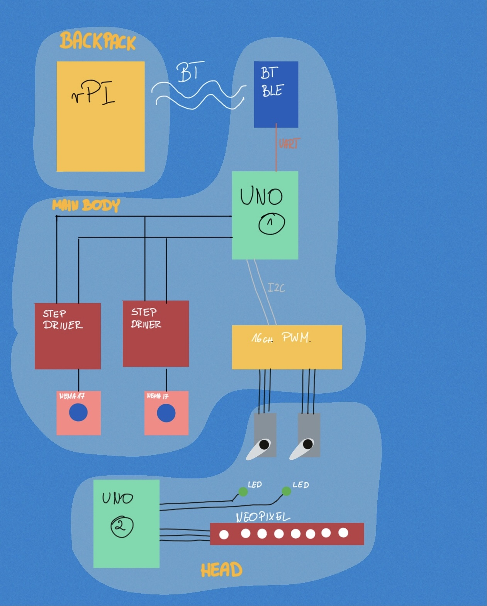
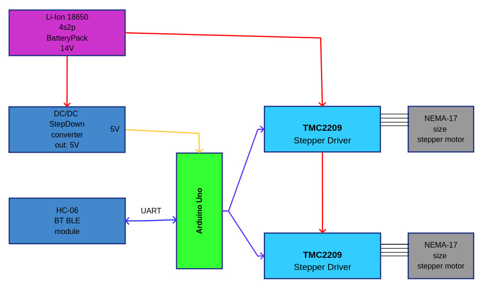
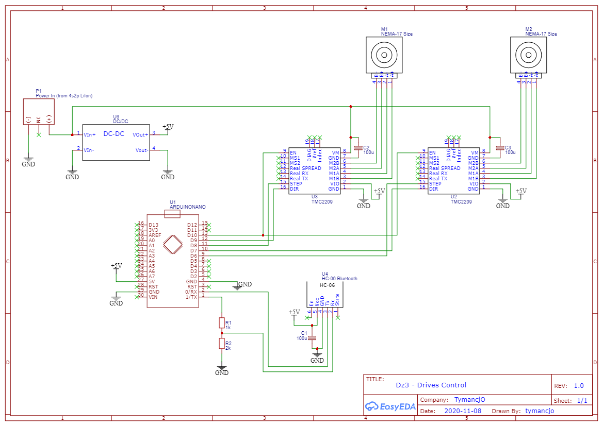
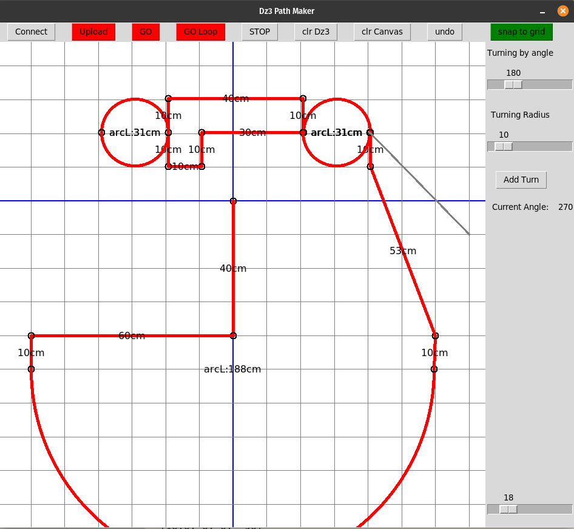

# Dz3 

## The Dzordz version 3.2 with support form the Tensor flow based camera people recognition.

This is experimental robot platform builded as R&D project to learn about general micro controllers and other stuff. 

The core moving functionality is made by use of the Arduino Uno which is driving the NEMA17 stepper motors via appropriate silent drivers. 
This allows to control the basic movements of the robot (driving it) by sending to the arduino special commands. More in depth description is in the "Dz3 - Arduino code communication" section of this readme. 

Additional functionality of the mentioned arduino uno is to control 16 channel PWM servo motors controller which allow for control of movement of animatronic parts.

The autonomous behavior are realized by the Raspberry PI 4 sbc which use webcam to observe the surroundings and make decisions how the robot shall behave. The required commands are send to the Arduino part via UART communication made by use of BLE connection. 

Some videos from from the continuos development are available here:
https://youtube.com/playlist?list=PL9g9iwA2sCQyebAMLQ3WOS7w4_cqAUxdq

The general scheme of operation of the current version looks like follow:

## The ML part

All video view analysis is based on the TensorFlowLight library which runs via Python library together with the openCV as a all picture handling library, and blake as a library for BLE communication. All code id in the Python folder. 

Previous intro:
>## The Dżordż version 3.1 with added remote control options

>This is an Adruino based Robot experiment. It works with python PC path maker and work little bit like CNC. 
This project is all about experimenting with Arduino based small driving robot unit that can be controlled by set of commands sent by uart/serial communication.
The basics are:
>- Robot is using 2 stepper motors oneforeach wheel
>- Root is usingAccelStepper library from Ardruino ecosystem (https://www.airspayce.com/mikem/arduino/AccelStepper/) 
>- The set of commands can be sent by any means - now it uses a Bluetooth BLE connection 

# Dz3 Arduino part Hardware description

The general idea of Dżordż3 (George 3) alias Dz3 is based on the quite universal platform that allows for experiments with basic robotics.

The whole Dz3 "ecosystem" is considered to be made of three block parts:
- Arduino controlled moving platform
- Python based software for macro level communication with Arduino part
- Raspberry Pi4 as a platform to run the python part

The moving platform is made according to this block diagram:

The electrical schematic looks like follow:

## Dz3 - Arduino code communication

The main ideaof the used communication code is based on sending 4 number sets in form:
**<C,a,b,c>**

where:

- C - the command
- a - firts parameter - in general distance to reavel in [cm]
- b - second parameter - in general angle to turn in [degrees] (in mathematical direction, means +90deg is "turn left 90deg")
- c - third parameter - in general set the speed of drive, if 0 it dont change previously set speed.

### Available commands:
- 0 - STOP, just stop the action asap. Other params ignored, can be used as <0>.
- 1 - FREE MOVE - just make the move based on te parameters.
- 8 - SOFT STOP - easy breaking with deflult acceleration. Other params ignored, can be used as <8>.
- 9 - UNDO  MOVE - move back to previous location.Other params ignored, can be used as <9>
- 
- 20 - ADD to SEQUENCE - adding the parameters as next move in sequence. This dont make the robot moves, just add to the memory
- 21 - ADD LAST MOVE to SEQUENCE - this adds last executed move (in exampleby command 1)to the memory as next onein sequence
- 22 - MAKES MOVE& ADD to SEQ. - makes the move just like command 1 and add it to the sequence
- 29 - REMOVE LAST STORED MOVE from SEQUENCE
-
- 30 - RUN the SEQUENCE - just starts to execute memorized commands
- 31 - RESUME SEQUENCE - starts the sequence from where it was stopped (by sending <0>whileexecuting)
- 33 - RUN in LOOP - execute the seqience like command 30 but in infinite loop (can be named "patrol mode")

### Examples of commands:
- <1,100,0,0> - move 1m ahead
- <1,0,360,0> - make 360 in place
- <21> - memorize last executed move
- <22, 100,90,300>- move 1m turning left (making arc) slowly (the 300) and savethis movein sequence
- ...

## The python app

The python app - **pypath.py** allows to draw path and ten convert it to the set of commands that are sent via comm port to the Dz3 as sequence steps. To be able to communicate to the Dz3 Arduino hardware control part it utilise the **python** **blake** library. This library connects to the robot BLE module diretcly. And this should work on all OS types - everwhere the 

The usage is pretty simple. It's a single window where a path made of straight lines and arcs can be sketch.

On the top a row of control buttons are placed as follow:
- Connect - initialize the serial connection
- Upload - upload the set of commands to the Dz3 *(green is serial available)*
- GO - start single execution of the recorded path *(green is serial available)*
- GO Loop - start execution of the path in loop *(green is serial available)*
- STOP - send a stop command to Dz3
- clr Dz3 - clear the path stored in Dz3 (arduino) memory
- clr Canvas - clear the program canvas
- undo - clears last move
- snap to grid - toggle the snap to 10 by 10cm grid

On the canvas the operations are based on mouse actions:
- left click - add point and aline from previous to this point
- wheel - zoom in/out
- right click & drag - move canvas

Adding the turn by arc is based on a angle and turn arc radius which can be set by the two sliders on the right. Mouse drag or mouse wheel allows to adjust those sliders.
The arc is added based on the last point of the path. If there are no points (not even he one click) the arc can't be added.     

## Visual based controls
The python app ML uses hte same connectiovity to the robot, but the rest is about computer vision and picture based controls. 

